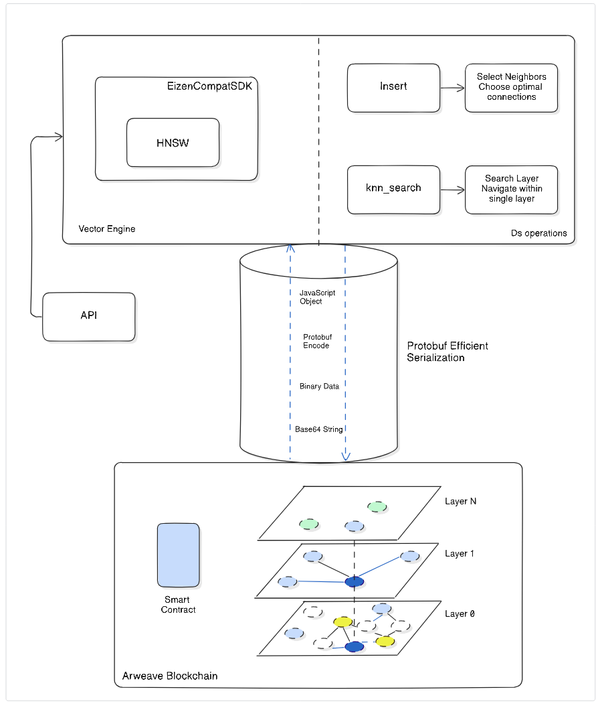

# Eizen

> The world's first decentralized vectordb engine built on Arweave blockchain

**Eizen** is a high-performance vector database engine for ArchiveNET built on Arweave that implements the Hierarchical Navigable Small Worlds (HNSW) algorithm for approximate nearest neighbor search. It provides efficient vector storage, similarity search, and metadata management with blockchain-based persistence.

## Key Features

- **HNSW Algorithm:** State-of-the-art approximate nearest neighbor search with `O(log N)` complexity
- **Blockchain Storage:** Persistent vector storage on Arweave with HollowDB integration
- **Protobuf Encoding:** Efficient serialization for optimal storage and network transfer
- **Metadata Support:** Rich metadata attachment to vectors for enhanced search capabilities
- **Flexible Interface:** Database-agnostic interface supporting multiple storage backends
- **Scalable:** Handles millions of high-dimensional vectors efficiently

## Architecture



### Algorithm Overview

The Hierarchical Navigable Small Worlds (HNSW) algorithm creates a multi-layer graph structure:

- **Layer 0**: Contains all vectors with dense local connections
- **Higher Layers**: Contain progressively fewer vectors with long-range connections
- **Search Process**: Navigate from top to bottom for logarithmic search complexity

### Core Components

#### 1. HNSW Class (`src/hnsw.ts`)

The main implementation containing:

- **`insert()`**: Add new vectors with metadata (Algorithm 1)
- **`knn_search()`**: Find k nearest neighbors (Algorithm 5)
- **`search_layer()`**: Core search primitive (Algorithm 2)
- **`select_neighbors()`**: Neighbor selection heuristic (Algorithm 4)

#### 2. Database Interface (`src/db/interfaces/`)

Abstraction layer supporting different storage backends:

- Point storage and retrieval
- Graph structure management
- Metadata operations
- Entry point tracking

#### 3. Utility Functions (`src/utils/`)

Mathematical operations and data structures:

- Distance functions (cosine, euclidean)
- Priority queues for search algorithms
- Vector operations (dot product, norm)

## Usage

You can create the VectorDB instance as follows:

```typescript
import { EizenDbVector } from "eizen";
import { WarpFactory, defaultCacheOptions } from "warp-contracts";
import { SetSDK } from "hollowdb";
import { Redis } from "ioredis";
import { RedisCache } from "warp-contracts-redis";
import { readFileSync } from "fs";

// connect to Redis
const redis = new Redis();

// create Warp instance with Redis cache
const warp = WarpFactory.forMainnet().useKVStorageFactory(
  (contractTxId: string) =>
    new RedisCache(
      { ...defaultCacheOptions, dbLocation: `${contractTxId}` },
      { client: redis }
    )
);

// create HollowDB SDK
const wallet = JSON.parse(readFileSync("./path/to/wallet.json", "utf-8"));
const contractTxId = "your-contract-tx-id";
const hollowdb = new SetSDK<string>(wallet, contractTxId, warp);

// create Eizen Vector with advanced HNSW parameters
const vectordb = new EizenDbVector(hollowdb, {
  m: 16, // connections per node (default: 5)
  efConstruction: 200, // build quality (default: 128)
  efSearch: 50, // search quality (default: 20)
});
```

### Inserting a Vector

With this, you can insert a new point:

```typescript
const point = [
  -0.28571999073028564 /* and many more... */, 0.13964000344276428,
];

// any object
const metadata = {
  name: "My favorite vector!",
  category: "research",
  filename: "document.pdf",
};

// insert a point
await vectordb.insert(point, metadata);
```

Metadata is optional, and you can leave it out during insert.

> [!NOTE]
> The complexity of inserting a point may increase with more points in the DB.

### Fetching a Vector

You can get a vector by its index, which returns its point value and metadata:

```typescript
const { point, metadata } = await vectordb.get_vector(index);
```

### Querying a Vector

You can make a query and return top K relevant results:

```typescript
// a query point
const query = [
  -0.28571999073028564 /* and many more... */, 0.13964000344276428,
];

// number of top results to return
const K = 10;

// make a KNN search
const results = await vectordb.knn_search(query, K);

// each result contains the vector id, its distance to query, and metadata
const { id, distance, metadata } = results[0];
```

### Deploying your own Contract

Eizen Vector exports a static function that allows you two deploy a new contract that you own. Assuming that you have a wallet and a warp instance as described above, you can create a new contract with:

```typescript
const { contractTxId } = await EizenDbVector.deploy(wallet, warp);
console.log("Deployed at:", contractTxId);
```

### Parameter Tuning Guide

| Parameter           | Purpose                    | Recommended Range      | Impact                                |
| ------------------- | -------------------------- | ---------------------- | ------------------------------------- |
| **M**               | Connections per node       | 5-48 (default: 5)      | Higher = better quality, more memory  |
| **ef_construction** | Build candidate list size  | 100-400 (default: 128) | Higher = better graph, slower build   |
| **ef_search**       | Search candidate list size | >= K (default: 20)     | Higher = better recall, slower search |

### Performance Characteristics

- **Time Complexity**: `O(log N)` for both insertion and search
- **Space Complexity**: `O(M × N)` where M is average connections per node
- **Scalability**: Efficiently handles millions of high-dimensional vectors
- **Distance Function**: Currently uses cosine distance (configurable)

## Contributing

We welcome contributions to Eizen! Please see our [contributing guidelines](../CONTRIBUTING.md) for details.

1. Fork the repository
2. Create a feature branch (`git checkout -b feature/amazing-feature`)
3. Commit your changes (`git commit -m 'Add amazing feature'`)
4. Push to the branch (`git push origin feature/amazing-feature`)
5. Open a Pull Request

## License

This project is licensed under the MIT License - see the [LICENSE](../LICENSE) file for details.

## Links

- **ArchiveNET**: [Main Repository](https://github.com/your-org/ArchiveNET)
- **Arweave**: [Permanent Storage Blockchain](https://arweave.org)
- **HNSW Paper**: [Efficient and robust approximate nearest neighbor search using Hierarchical Navigable Small World graphs](https://arxiv.org/pdf/1603.09320.pdf)
- **HollowDB**: [Arweave Key-Value Database](https://github.com/firstbatchxyz/hollowdb)

## Acknowledgments

- Built on the revolutionary Arweave blockchain
- HNSW algorithm implementation based on `Malkov` & `Yashunin's` research
- Inspired by the need for decentralized AI memory systems
- Special thanks to the Arweave and HollowDB communities
